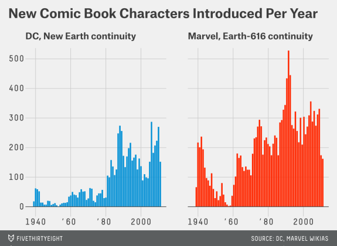
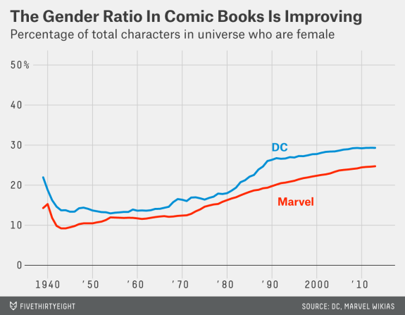

```{r setup, include=FALSE}
knitr::opts_chunk$set(echo = TRUE)
library(tidyverse)
library(fivethirtyeight)
```


### The data

The data for this assignment comes from FiveThirtyEight. They post data on their 
[github page](https://github.com/fivethirtyeight/data/), and Albert Kim created 
an R package that contains the data so it is easily accessible in R. 

We'll be looking at the `comic_characters` dataset. You can load it by running 

```{r}
data(comic_characters)
```

### The assignment

Your assignment is to use the data to reproduce the graphics in the article 
[Comic Books Are Still Made By Men, For Men And About Men](https://fivethirtyeight.com/features/women-in-comic-books/). For 75% credit 
on the assignment, reproduce just the first graphic 



For 100% credit, reproduce that graphic and the second one,



Fair warning, I think the first one will be easy (in other words, require very little data wrangling) and the second one will be much more challenging. 

As with the last assignment, the final deliverable is a `.md` file on Github. 
In the file, I will be looking for embedded rendered images (as similar to the 
originals as you can make them), code to do the data wrangling and visualization, 
and some narrative text explaining what you did, and what decisions you had to make
in order to get the graphic to come out the way it did. 

Please include all your group member's names in the header of the document. 

### Hints

Some useful functions/packages you may want to check out:
- `ggthemes` package
- `cumsum` function